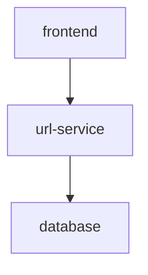

# URL-GO

URL-GO is a website with a GO backend and a Javascript frontend where users can shorten a URL and share it with ease. The vision for this site is to
have users who enter the website be presented with an input prompt and an option to select when the link expires. There will also be a page that displays statistics for popular links.

## Components

The application will conist of three main components:

1. Javascript frontend for users to interact with, framework TBD.
2. URL service where long URLs will be converted to short URLs and vice versa.
3. Postresql database to store a data related to short URLs.

Stretch Goals:

4. Analytics service that tracks statistics for popular links.
5. Redis cache to speed up URL redirects for frequently visited short URLs

## Database

For this project I went with SQL instead of NoSQL due to two reasons. I originally intended to use this as an opportunity to learn GORM and also reasoned that the relational nature of the analytics service may benefit from it. If I were to redo this project I would likely just select Redis due to its ease of use and scalability.

| URL          |                       |
| ------------ | :-------------------: |
| hash (PK)    |   char(7) NOT NULL    |
| raw_url      | varchar(255) NOT NULL |
| created_date |  timestamp NOT NULL   |

## Hashing Mechanism

To generate a short URL, we will

- Take the MD5 hash of the original URL + timestamp.

  - MD5 is a widely used hashing function that produces a 128-bit hash value

- Base 62 encode the MD5 hash and take the first 7 characters
  - This results in 62^7 possible values, should easily be able to handle whatever is thrown at us.
