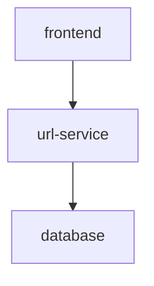

# URL-GO

URL-GO is a website with a GO backend and a Javascript frontend where users can shorten a URL and share it with ease. The vision for this site is to
have users who enter the website be presented with an input prompt and an option to select when the link expires. There will also be a page that displays statistics for popular links.

## Components

The application will conist of three main components:

1. Javascript frontend for users to interact with, framework TBD.
2. URL service where long URLs will be converted to short URLs and vice versa.
3. Postresql database to store a data related to shortlink.

Stretch Goals:

4. Statistics service that generates content for popular links.
5. Redis cache to speed up URL redirects for frequently visited short URLs

